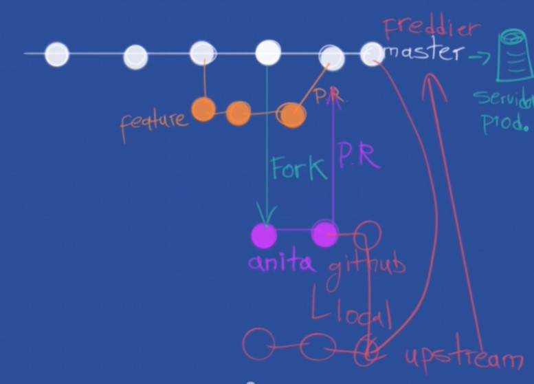

# Hyperblog

**Un block increible para el curso de Git y Github**

### En esta guia tendras comandos y tips de gran utilidad :fa-heart:

# Commands Git

- **git log **--oneline - Te muestra el id commit y el título del commit.
- git log --decorate- Te muestra donde se encuentra el head point en el log.
- git log --stat - Explica el número de líneas que se cambiaron brevemente.
- git log -p- Explica el número de líneas que se cambiaron y te muestra que se cambió en el contenido.
- git shortlog - Indica que commits ha realizado un usuario, mostrando el usuario y el titulo de sus commits.
- git log --graph --oneline --decorate y
- git log --pretty=format:"%cn hizo un commit %h el dia %cd" - Muestra mensajes personalizados de los commits.
- git log -3 - Limitamos el número de commits.
- git log --after=“2018-1-2” ,
- git log --after=“today” y
- git log --after=“2018-1-2” --before=“today” - Commits para localizar por fechas.
- git log --author=“Name Author” - Commits realizados por autor que cumplan exactamente con el nombre.
- git log --grep=“INVIE” - Busca los commits que cumplan tal cual está escrito entre las comillas.
- git log --grep=“INVIE” –i- Busca los commits que cumplan sin importar mayúsculas o minúsculas.
- git log – index.html- Busca los commits en un archivo en específico.
- git log -S “Por contenido”- Buscar los commits con el contenido dentro del archivo.
- git log > log.txt - guardar los logs en un archivo txt
- git grep color -->use la palabra color
- git grep la --> donde use la palabra la
- git grep -n color–> en que lineas use la palabra color
- git grep -n platzi --> en que lineas use la palabra platzi
- git grep -c la --> cuantas veces use la palabra la
- git grep -c paltzi --> cuantas veces use la palabra platzi
- git grep -c “
”–> cuantas veces use la etiqueta 

- git log-S “cabecera” --> cuantas veces use la palabra cabecera en
  todos los commits.

grep–> para los archivos
log --> para los commits.

- git shortlog -sn: muestra cuantos commit han hecho cada miembro del equipo.
- git shortlog -sn --all: muestra cuantos commit han hecho cada miembro del equipo, hasta los que han sido eliminados.
- git shortlog -sn --all --no-merge: muestra cuantos commit ha hecho cada miembro, quitando los eliminados sin los merges.
- git blame ARCHIVO: muestra quien hizo cada cosa línea por línea.
- git COMANDO --help:muestra como funciona el comando.
- git blame ARCHIVO -Llinea_inicial,linea_final: muestra quien hizo cada cosa línea por línea, indicándole desde qué línea ver. Ejemplo -L35,50.
- git branch -r: se muestran todas las ramas remotas.
- git branch -a: se muestran todas las ramas, tanto locales como remotas.

# SSH --- Protocolo Security shell

## Generar una nueva llave SSH: (Cualquier sistema operativo)

## ssh-keygen -t rsa -b 4096 -C "youremail@example.com"

Comprobar proceso y agregarlo (Windows)

eval $(ssh-agent -s) ssh-add ~/.ssh/id_rsa

Cambiar la url / ir a url ssh del proyecto

git remote-v ---> Muestra estado actual del direccion de repositorio
git remote set-url origin ssh del proyecto
ejemplo git remote set-url origin git@github.com:MariaRios1214-dev/hyperblock.git

**Comprobar proceso y agregarlo (Mac)**

eval "$(ssh-agent -s)"
¿Usas macOS Sierra 10.12.2 o superior?
Haz lo siguiente:

cd ~/.ssh
Crea un archivo config…
Con vim config
Con VSCode code config
Pega la siguiente configuración en el archivo…
Host \*
AddKeysToAgent yes
UseKeychain yes
IdentityFile ~/.ssh/id_rsa

**Agrega tu llave privada en tu entorno**

ssh-add -K ~/.ssh/id_rsa

# Alias para guardar comandos

alias pathRamas="git log --all --graph --decorate --oneline"
y luego solo es llamar el alias ej **pathRamas**

# Tags

## create tags con hash (commit corto)

$ git tag -a v0.1 -m "Resultado de las primeras clases del grupo" 963f613

## ver tags

$ git tag
v0.1

## ver tags con relacion al commit hash (commit corto)

$ git show-ref --tags
2550019ebd4eede402e9b3e3dd15424158c2c205 refs/tags/v0.1

## empujar los tags al ambiente

$ git push origin --tags

##borar tags
$ git tag -d v0.2

##eliminar totalmente la referencia del tags / borrado permanente
$ git push origin :refs/tags/v0.2

Warning: Permanently added the ECDSA host key for IP address '140.82.112.4' to the list of known hosts.
To github.com:MariaRios1214-dev/hyperblock.git

- [deleted] v0.2

## Pull Request GitHub(Merge request Gitlab, push request bitbucket)

Funcionalidad que crea una solicitud de revision y/o aprobacion, en donde a nivel de conversaciones se puede se puede dar seguimiento a un cambio solicitado.

El flujo del pull request es el siguiente

Se trabaja en una rama paralela a master, los cambios que se van implementar (git checkout -b )
Se hace un commit a la nueva rama (git commit -am '')
Se suben al repositorio remoto los cambios (git push origin )
En GitHub se hace el pull request comparando la rama master con la rama del fix.
Uno, o varios colaboradores revisan que el código sea correcto y dan feedback (en el chat del pull request)
Martener la nueva rama actualizada con los cambios que se hagan en la rama base (master)
El colaborador hace los cambios que desea en la rama y mantiene la rama del pull request actualizada (Cuando se modifica una rama, también se modifica el pull request)
Se aceptan los cambios en GitHub
Se hace merge a master desde GitHub

# Fork

**Forks o Bifurcaciones**
Es una característica única de GitHub en la que se crea una copia exacta del estado actual de un repositorio directamente en GitHub, éste repositorio podrá servir como otro origen y se podrá clonar (como cualquier otro repositorio), en pocas palabras, lo podremos utilizar como un git cualquiera
.
Un fork es como una bifurcación del repositorio completo, tiene una historia en común, pero de repente se bifurca y pueden variar los cambios, ya que ambos proyectos podrán ser modificados en paralelo y para estar al día un colaborador tendrá que estar actualizando su fork con la información del original.
.
Al hacer un fork de un poryecto en GitHub, te conviertes en dueñ@ del repositorio fork, puedes trabajar en éste con todos los permisos, pero es un repositorio completamente diferente que el original, teniendo alguna historia en común.
.
Los forks son importantes porque es la manera en la que funciona el open source, ya que, una persona puede no ser colaborador de un proyecto, pero puede contribuír al mismo, haciendo mejor software que pueda ser utilizado por cualquiera.
.
Al hacer un fork, GitHub sabe que se hizo el fork del proyecto, por lo que se le permite al colaborador hacer pull request desde su repositorio propio.

**TRABAJANDO CON MÁS DE 1 REPOSITORIO REMOTO**
Cuando trabajas en un proyecto que existe en diferentes repositorios remotos (normalmente a causa de un fork) es muy probable que desees poder trabajar con ambos repositorios, para ésto puedes crear un remoto adicional desde consola.

- git remote add <nombre_del_remoto> <url_del_remoto>
- git remote upstream https://github.com/MariaRios1214-dev/hyperblock.git
  Al crear un remoto adicional podremos, hacer pull desde el nuevo origen (en caso de tener permisos podremos hacer fetch y push)

- git pull <remoto> <rama>
- git pull upstream master
- Éste pull nos traerá los cambios del remoto, por lo que se estará al día en el proyecto, el flujo de trabajo cambia, en adelante se estará trabajando haciendo pull desde el upstream y push al origin para pasar a hacer pull request.

- git pull upstream master
- git push origin master

Creado por: Mafe Rios
\*Este ejercicio incluye documentacion para Git

- Diverso y attrativo para todos
